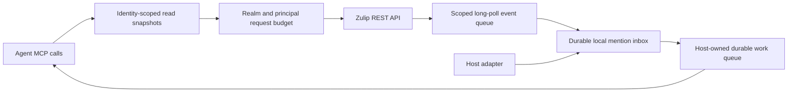

# Zulip API coverage and efficient agent access

Reviewed on 2026-10-09 for unpublished v0.7.4. The review used Zulip's complete
[canonical OpenAPI](https://github.com/zulip/zulip/blob/main/zerver/openapi/zulip.yaml),
[real-time event documentation](https://zulip.com/api/real-time-events),
[HTTP headers and rate limits](https://zulip.com/api/http-headers), and the
installed Zulip SDK 0.9.1. The reviewed OpenAPI bytes have SHA-256
`d179f23dba27fb1f0f571998fea18ad1bc774c01dcf421a6dc1df7313ff10f28`.
Upstream documentation on `main` changes independently of this release.

ZulipChat MCP is a curated agent interface to Zulip. Its 20 core or 60 extended
tools cover messaging, search, channels/topics, people, drafts, scheduled
messages, attachments, reactions, flags, events, analytics, and durable agent
sessions. It does not expose unrestricted REST forwarding. Authentication-key
creation, organization administration, invitations, mobile push, and many
browser-specific operations remain outside the registered surface. Some
additional operations exist only as internal client wrappers.

The [operation inventory](zulip-api-coverage.json) records every method/path
entry in the reviewed OpenAPI, distinguishes registered tools from internal
wrappers and unexposed operations, and identifies three documentation-only
entries. It includes reviewed coordinator/listener paths as well as static
tool-to-client reachability. This is a coverage inventory, not a claim that
every parameter, permission, or operation was exercised against a live server.
The tests exercise representative registered-tool and upstream boundaries;
the [live Clio experiment](../testing/clio-bot-mentions.md) records the much
narrower behavior actually observed with real accounts.

## Snapshot reads and event deltas

Message windows and individual message reads cache successful API responses
for 15 seconds. Each wrapper's scope includes its realm, principal and selected
user/bot identity. Raw Markdown and rendered HTML requests have different keys.
Identical concurrent reads in one process share a fetch. Each cache retains
at most 64 responses of at most 512 KiB each; larger responses are returned
without being cached. API errors are never stored as successful snapshots.

Server caches can persist beside the account-bound database. A same-account
restart can reuse a still-fresh response. Returned cache metadata includes the
capture time in UTC, age, TTL, content hash and hit/miss state. `fresh=True` on
`search_messages` or `get_message` bypasses reuse. Recovery paths always fetch
new upstream windows. Successful sends, edits, explicit-ID flag updates and
received message events invalidate same-process realm snapshots. Other changes,
including bulk flag/reaction operations, changes made by another process or in
unwatched channels, can remain cached until the short TTL expires; use
`fresh=True` to verify the immediate result of those operations. A cached
response during an API cooldown remains a dated observation, not a new one.

The mention inbox is a separate rolling snapshot of explicitly mentioned bot
messages. It registers a channel-scoped event queue before fetching history,
then persists new message events and the event cursor in one transaction.
Ordinary `poll_agent_events(mentions_stream=...)` calls read this local inbox;
they do not repeat the history query. The background producer uses blocking
event polling, including heartbeat responses. Empty fast responses have a
minimum delay, and failures use bounded exponential backoff and the server's
retry delay.

One producer per local inbox is enforced with an OS advisory lock held by its
worker for its lifetime. Another process cannot start a competing producer;
it reports `INBOX_ALREADY_OWNED` in listener health. Connect multiple hosts to
the existing server. A server can lazily watch at most four channels. These
local locks and caches do not provide distributed ownership across machines.

On queue expiration, the producer registers a replacement before recovering
messages after its durable message-ID watermark, then deduplicates the overlap.
The first snapshot is bounded to 50 mentions; recovery is bounded to 20 pages
of 50 per registration attempt. Persistent recovery progress survives a retry.
No saved cursor means a bounded recent snapshot, not all historical mentions.
Hosts should establish an explicit starting watermark before enabling work.

The rolling inbox retains at most 10,000 messages, with task text capped at
6,000 characters. Deleted and edited inputs become tombstones rather than
silently becoming a new executable task. Truncation and a consumer falling
behind retention are explicit. A `partial` response, unhealthy listener or
`cursor_gap` must be resolved before dispatching new work.

## Rate limits and truthful outcomes

Zulip documents a default limit of 200 requests per user per minute; deployments
can configure different limits. Client wrappers in one MCP process share
admission by normalized realm and principal. Requests are spaced at least
0.5 seconds apart, with a bounded two-second admission wait. Official
`X-RateLimit-Limit`, `X-RateLimit-Remaining` and `X-RateLimit-Reset` headers can
reduce the launch rate. These are request-start limits: an outstanding long
poll does not hold the admission lock.

HTTP 429, JSON `RATE_LIMIT_HIT`, JSON `retry-after`, numeric or HTTP-date
`Retry-After`, and reset headers impose a shared cooldown. A call during that
cooldown returns a retryable result with the remaining delay without making an
upstream request. The SDK's transparent retry loops are disabled, including
its special long-poll retry loop. The background listener makes its own bounded
recovery decisions. Writes are submitted once; callers must resolve uncertain
delivery before retrying. Budgets are per process, not a global quota shared
with other clients using the same account.

Tools preserve backend error codes and retry instructions where available.
Application `status="error"` becomes MCP `isError=true`, so hosts do not show
a failed operation as a successful call. A requested channel detail that fails
is `partial` with a component error, while available basic information remains
usable. A Zulip send followed by failed local recording retains its delivered
message ID and unsafe-retry warning. Bounded waits with a still-pending request
are `timeout`, not failed sends or terminal denials.

## REST semantics that agents must preserve

- Search returns a bounded window. Report fetched and returned counts, UTC
  dates, bounds, excerpt truncation and the cache observation time. An empty
  window is not proof that a channel has no older messages.
- Follow message-ID anchors for pagination and stop when the backend reports
  the relevant boundary. Recovery uses date anchors only at feature level 445
  or newer; older servers use message-ID pagination. Zulip timestamps have
  integer-second precision, which listener creation bounds must respect.
- Zulip sends accept Markdown. Copy operations fetch raw Markdown rather than
  forwarding rendered HTML. Ordinary search explicitly labels rendered
  excerpts; individual reads keep the compatibility default.
- HTTP cannot access the server's local upload paths. Arbitrary binary input
  uses bounded, strictly decoded `file_content_base64`; the existing text
  input remains available.
- Bulk flag operations paginate the actual registered tool. Starring includes
  already-read messages. A later-page failure reports partial progress.
- Selected credential files supply their realm and principal together. Bot
  environment credentials without a separate file use the selected user's
  effective realm. Persisted control-plane state is bound to the effective
  account; a change of organization is not an in-place state migration.
- Zulip increasingly calls streams “channels”; stable numeric IDs are the
  host's routing authority, while older SDK field names remain compatible.
  `server_info`'s configured bot name is a label. The authenticated bot profile
  and numeric `bot_user_id` establish the actual identity.

The OpenAPI comparison corrected numeric stream lookup to `GET /streams/{id}`,
subscription-property fallback to `POST /users/me/subscriptions/properties`,
and topic-mute fallback to `PATCH /users/me/subscriptions/muted_topics`.
Fake tests assert the upstream method/path and both legacy and modern MCP
results. The reviewed endpoints retain Zulip's compatibility display behavior
for empty topics; this release does not claim a complete new-topic API migration.

## Efficient host workflow and ownership

An ordinary `@BotName summarize this topic` message can enter the inbox without
an existing agent session. The host verifies the configured realm, numeric bot,
sender and channel; checks readiness, cursor continuity and truncation; and
atomically enqueues the task with its consumer cursor. The message ID is the
task's deduplication key. Treat its content as user task data, never as a tool
definition or executable shell command.

The host maintains a stable agent/topic binding separately from individual
task IDs. Register the profile once, retain `agent_id` and `session_id`, and
reuse that session for later mentions in the same topic. A new external session
ID for each mention conflicts with the existing topic binding. A lost binding
requires reconciliation, not a replacement topic or duplicate result send.
Reply in the original topic using the configured bot and `agent_message`.

The MCP server owns Zulip credentials, API translation, local persistence,
message transport and correlated question/approval state. Clio, Codex or another
host owns model selection, process launch, workspace admission, native tool
permissions, cancellation and completed-task receipts. Receiving `/cancel`
does not prove an OS process stopped. Installing an MCP declaration or skill
does not start an unattended runner. Ordinary mentions require no `/reply`;
explicit questions and approvals retain request IDs to disambiguate them.

Start with a bounded search and reuse its result. Expand only the selected
message IDs whose omitted content matters. Stop unchanged policy-denial retries.
Use short waits while retaining the original request ID. Validate claims about
current GitHub or project state against those sources rather than interpreting
an old Zulip announcement as current status.

## Local privacy and operational limits

Snapshot and inbox files contain Zulip message content. They use private file
permissions and reject symlink destinations; no API keys are stored in them.
TTL controls whether a read can be reused, not deletion of every expired byte.
Protect the account database directory, include caches in local data-retention
decisions, and clear its `cache` directory after stopping the server when needed.
Do not publish live ledgers or institutional message bodies with test artifacts.

Agent state and producer ownership remain single-instance local workflows.
Shared static HTTP authentication is not per-user authorization. Numeric host
pairing and an inbox are not a computer-execution permission grant. Linux locks,
source/package contracts, and scoped live Clio behavior were tested; the Windows
lock implementation and other coding-host applications were not launched here.
